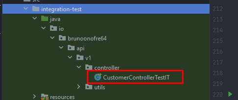
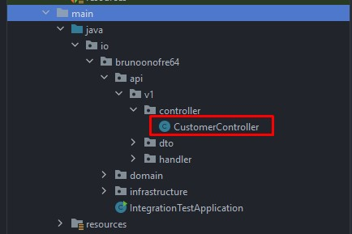

# Integration-Test Project 👨🏻‍💻
###### Projeto inicializado usando o [Spring Initializr](https://start.spring.io/) 🍃
###### Usado Java 11
###### Classe de testes [Integration-Test](https://github.com/brunoonofre64/Integration-Test/blob/master/src/integration-test/java/io/brunoonofre64/api/v1/Controller/CustomerControllerTestIT.java)
###### --------------------------------------------------------------------------------------------------------------------------------------------------
## JAVA ☕ + SpringBoot 🍃
### Aqui neste projeto, foi desenvolvida uma RESTFUL API, onde pude usar as melhores boas práticas de desenvolvimento que possuo conhecimento, tais como:

* Orientação ao Objeto
* Stream API
* Data Transfer Object (DTO)
* Padrão Repository
* Clean Code
* Separação da regra de negócio dos casos de uso
* Tratamento personalizado de erros da API com Exception Handling
* Teste de integração
* Liquibase, para gerenciar a criação e exclusão de tabelas na minha camada de teste de integração
* Externalização das menssagem de erro lançadas pela API
* E etc..
###### --------------------------------------------------------------------------------------------------------------------------------------------------
### Teste de integração passo a passo e dica de boas práticas! 📝

##### É uma boa prática, que ao criar nossa camada de testes de integração, criarmos um caminho igual ao da nossa camada *****main*****, preservando o design da estrutura, que futuramente facilitará localizar os testes.
###### Exemplo abaixo:
###### Camada de Teste de Integração:

###### Camada main:

##### OBS: Percebam que ambas fizeram o mesmo caminho até chegar no controller.

#### ****Classe de teste:****
##### Nossa classe deve possuir o mesmo nome do Controller, do qual ela irá simular as requisições, com a diferença que no final acrescentamos *****TestIT*****, ex: ******CustomerControllerTestIT******
###### --------------------------------------------------------------------------------------------------------------------------------------------------

#### Anotações na classe:

* *****SpringBootTest*****
###### Responsável por criar contexto da aplicação Spring, permitindo a injeção de dependência e demais funcionalidades do framework
* *****webEnvironment*****
###### O parâmetro webEnvironment = WebEnvironment. RANDOM_PORT serve para indicar que queremos que a aplicação suba com uma porta aleatória.
* *****AutoConfigureMockMvc*****
###### Anotação que pode ser aplicada a uma classe de teste para ativar e configurar a configuração automática do MockMvc.
###### --------------------------------------------------------------------------------------------------------------------------------------------------

 
