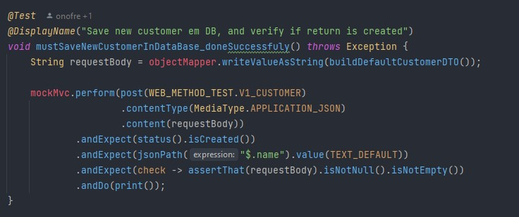
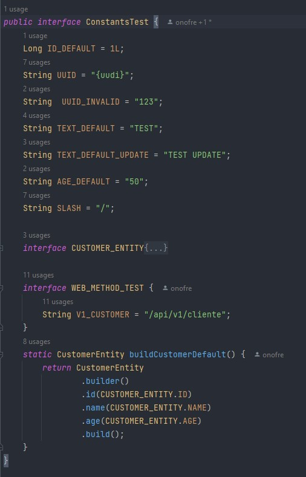

# Integration-Test Project 👨🏻‍💻
###### Projeto inicializado usando o [Spring Initializr](https://start.spring.io/) 🍃
###### Usado Java 11
###### Classe de testes [Integration-Test](https://github.com/brunoonofre64/Integration-Test/blob/master/src/integration-test/java/io/brunoonofre64/api/v1/Controller/CustomerControllerTestIT.java)
###### --------------------------------------------------------------------------------------------------------------------------------------------------
## JAVA ☕ + SpringBoot 🍃
### Aqui neste projeto, foi desenvolvida uma RESTFUL API, onde pude usar as melhores boas práticas de desenvolvimento que possuo conhecimento, tais como:

* Orientação ao Objeto
* Stream API
* Data Transfer Object (DTO)
* Padrão Repository
* Clean Code
* Separação da regra de negócio dos casos de uso
* Tratamento personalizado de erros da API com Exception Handling
* Teste de integração
* Liquibase, para gerenciar a criação e exclusão de tabelas na minha camada de teste de integração
* Externalização das menssagem de erro lançadas pela API
* E etc..
###### --------------------------------------------------------------------------------------------------------------------------------------------------
### Teste de integração passo a passo e dica de boas práticas! 📝

##### É uma boa prática, que ao criar nossa camada de testes de integração, criarmos um caminho igual ao da nossa camada *****main*****, preservando o design da estrutura, que futuramente facilitará localizar os testes.
###### Exemplo abaixo:
###### Camada de Teste de Integração:

###### Camada main:

##### OBS: Percebam que ambas fizeram o mesmo caminho até chegar no controller.

#### ****Classe de teste:****
##### Nossa classe deve possuir o mesmo nome do Controller, do qual ela irá simular as requisições, com a diferença que no final acrescentamos *****TestIT*****, ex: ******CustomerControllerTestIT******
###### --------------------------------------------------------------------------------------------------------------------------------------------------

#### Anotações na classe:

* *****SpringBootTest*****
* ###### Responsável por criar contexto da aplicação Spring, permitindo a injeção de dependência e demais funcionalidades do framework
* *****webEnvironment*****
* ###### O parâmetro webEnvironment = WebEnvironment. RANDOM_PORT serve para indicar que queremos que a aplicação suba com uma porta aleatória.
* *****ActiveProfiles*****
* ###### É uma anotação de nível de classe usada para declarar quais perfis de definição serão inicializados junto com a aplicação, em nosso caso o "TEST-H2", é um perfil já configurado em um arquivo application-TEST-H2.properties.
* *****AutoConfigureMockMvc*****
* ###### Anotação que pode ser aplicada a uma classe de teste para ativar e configurar a configuração automática do MockMvc.
###### --------------------------------------------------------------------------------------------------------------------------------------------------

#### Dependências injetadas e setup:

* *****CustomerRepository*****
* ###### Responsável pelas operações de CRUD que serão realizadas no nosso banco de dados em memória H2-Database, onde já traz consigo os métodos necessários, para gerenciar dados.
* *****ObjectMapper*****
* ###### ObjectMapper é uma classe da biblioteca Jackson. Ela pode transformar classes POJO (Plain Old Java Objects) em JSON (JavaScript Object Notation) e vice-versa.
* *****MockMvc*****
* ###### É  definido como um ponto de entrada principal para testes Spring MVC do lado do servidor. Testes com MockMvc ficam em algum lugar entre os testes de unidade e integração.
* *****CustomerMapper*****
* ###### É uma interface pública que possui métodos de conversão que auxiliam quando por exemplo, converter um CustomerEntity em CustomerDTO e vice-versa.
* *****@BeforeEach***** ****E**** ****setUp****
* ###### Um método anotado com @BeforeEach, é executado antes de qualquer método que for executado dentro da classe de teste de integração.
* ###### Nosso método setUp(), somado ao @BeforeEach, sempre antes da execução de qualquer método, ele fará um deleteAll() no repositório, assim garantindo que nosso banco de dados estará vazio, e pronto para o próximo teste.
###### --------------------------------------------------------------------------------------------------------------------------------------------------

#### Casos de testes:
* ###### Nosso primeiro caso de teste será a simulação de uma requisição POST, onde dará tudo certo.

* *****Interface-para-auxílio-nos-testes-constantes*****

* *****requestBody***** 
* ###### Ele receberá o corpo da nossa requisição, onde o objectMapper chama seu método writeValueAsString(), que pode converter objetos em geral em JSON, e ele recebe um método que cria um dto com as propriedades necessárias, para que ocorra tudo bem no teste da requisição.
* *****perform***** 
* ###### mockMvc, como já foi explicado antes, ele será o ponto de partida, para o nosso teste, ele chama o método perform(), onde ele recebe a classe MockMvcRequestBuilder() que através dela, chamamos o método statico que referencia o tipo de requição da nossa API, nesse caso será o método POST, mas esse conceito, serve para todos os demais métodos HTTP.
* ###### No corpo do nosso método POST, passaremos a URI, no caso, eu atribui a variável String V1_CUSTOMER dentro de uma interface, junto de outras situações estáticas, para reuso durante nossos testes.

 
